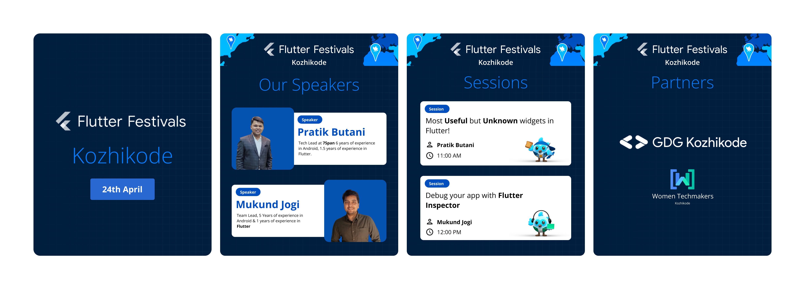

<h1 align="center">Flutter Festival Kozhikode 🎉 </h1>

On April 24, 2022

 

 

The most awaited event is here! We are super excited to announce Flutter Festival Kozhikode! We will be hosting multiple sessions for you to master Flutter with ezz! Who might not want to get some swags? 🎁 Join the Flutter Quiz and get a chance to invite Dash to your home! 

 

We’re so glad to have Pratik Butani and Mukund Jogi as our speakers for the sessions!

 

Join us for the party on 24th April 2022 - Online 🌐.  
Don’t forget to Register here: https://bit.ly/flutterfestkkd-2022! 

## 👨🏻‍💻What is the Flutter Festival?
Flutter Festivals are the largest community-led Flutter events across the globe! Learn about 🆕 Flutter updates, how to build and ship your Flutter apps efficiently, and connect with your fellow community geeks! 

When and Where?
On 24th April 2022 - Online 🌐

## 📅 Agenda 

- 11:00 AM - **Most Useful but Unknown widgets in Flutter** - session by [Pratik Butani](https://github.com/pratikbutani).

- 12:00 PM - **Debug your app with Flutter Inspector** - session by [Mukund Jogi](https://github.com/mukund-7span)

- **Flutter Quiz** 
Use your Flutter Knowledge and win some cool swags! 🛰
	

All posters can be found [here](assets/posters/).

 

## 👋 See ya there!

As always, feel free to join our [Telegram group for discussion](https://t.me/flutterkozhikode) or subscribe to our [Google Calendar](https://bit.ly/flutterkkd-calendar) to get notified about upcoming events! 

