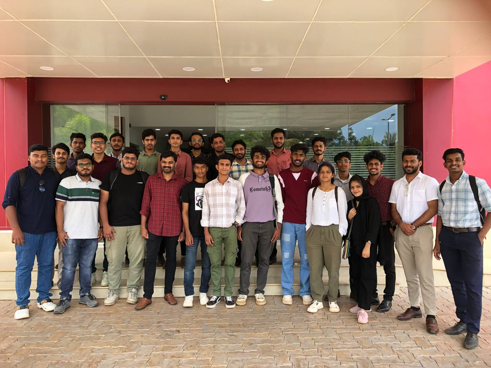
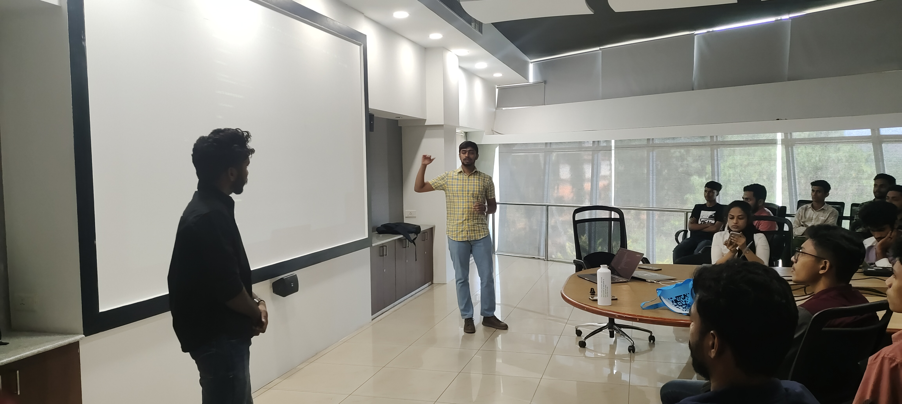
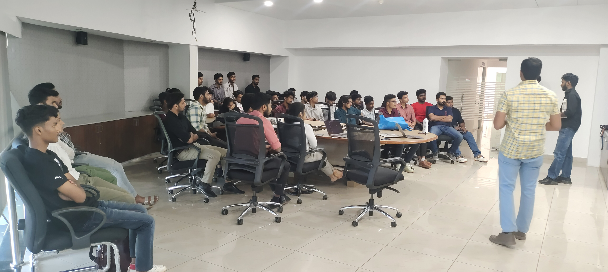
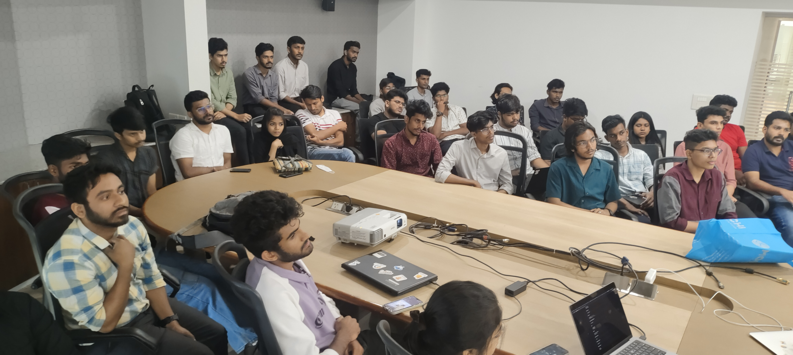
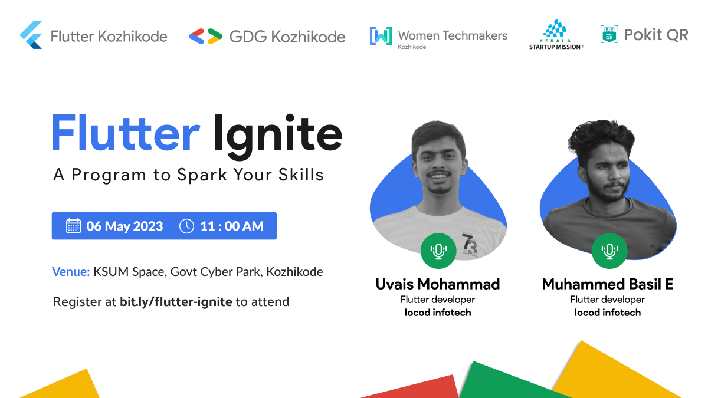

# Flutter Ignite: A Program to Spark Your Skills

    
      
    
    
    

 

## ❤️ Long Story Short

This is one of the best events we have ever hosted. We had 40+ attendees and the event was a huge success.

Speakers: [Muhammed Basil](https://www.linkedin.com/in/muhammed-basil-0a2b691b2/) and [Uvais Mohammad](https://www.linkedin.com/in/uvais-mohammad-024440164/).

Follow them on LinkedIn:

## 📚 Resources

Checkout the resources that we have shared during the event here:

## 📝 TL;DR

Ready to ignite your Flutter skills? Register now for Flutter Ignite and join us for an exciting event that'll take your skills to the next level! Don't miss out on this opportunity to network with other developers and gain valuable insights from our expert speakers.

📍 Venue: KSUM, Govt. Cyber Park, Kozhikode

🗓 Date & Time: 06th May 2023

🔗 Register here: https://gdg.community.dev/e/mz68r9/

## 🥳 Event Details

Flutter Kozhikode presents "Flutter Ignite: A Program to Spark Your Skills" - a one-of-a-kind event to enhance your skills in Flutter app development. This event is designed for Flutter enthusiasts, developers, and students who are eager to learn the latest trends and techniques in Flutter development.

Join us on April 6th, 2023, at 11 AM at the Kerala Startup Mission Space (KSUM Space) at Govt. Cyber Park Kozhikode to meet our two esteemed resource persons - Muhammed Basil E and Uvais Mohammad. Both of them are experienced Flutter developers at Iocod Infotech and are prominent in the Flutter community.

At the event, you'll have the opportunity to gain insights on Flutter app development, understand the Flutter framework, and explore the best practices for developing engaging mobile applications. You'll also learn about the latest features of Flutter, how to leverage them to create dynamic user interfaces and tips for optimizing performance.

 

 

---

Feel free to join our [Telegram group for discussion](https://t.me/flutterkozhikode) or subscribe to our [Google Calendar](https://bit.ly/flutterkkd-calendar) to get notified about upcoming events!
